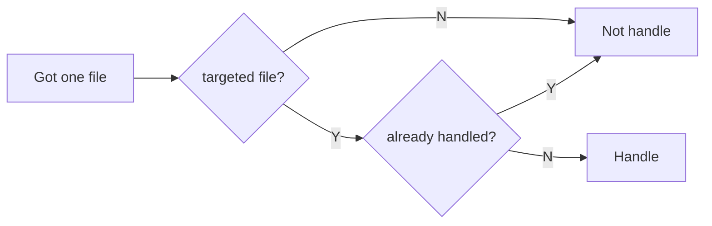
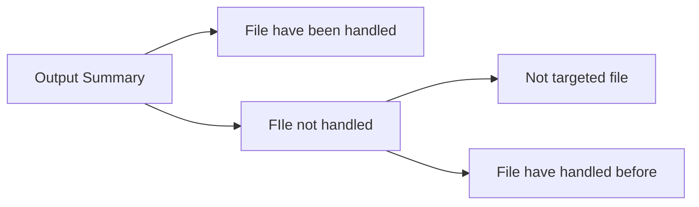

# media-archiver

## Python
Version: 3.11.0

### Functions

### Workflow

#### Handle logic

#### Output summary

## References

- https://blog.csdn.net/wangli_010/article/details/127402288
- https://github.com/pallets/click
- 